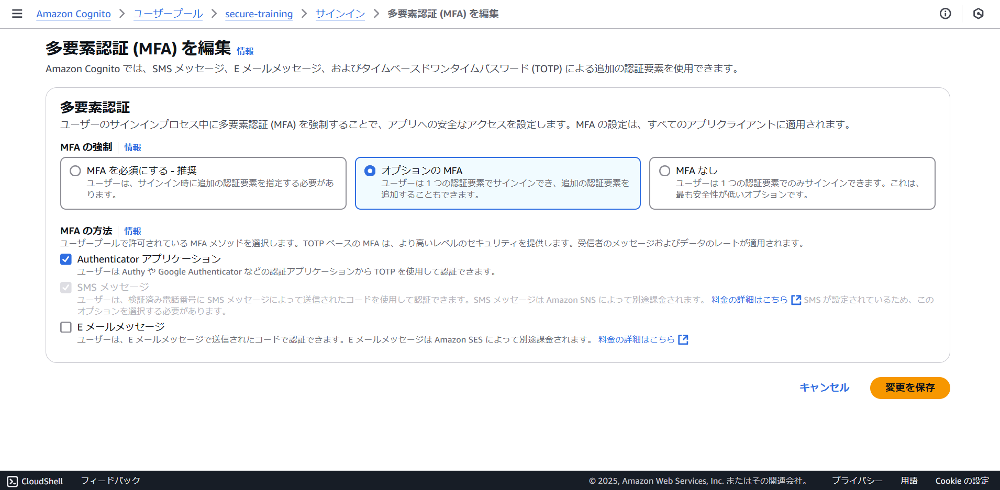
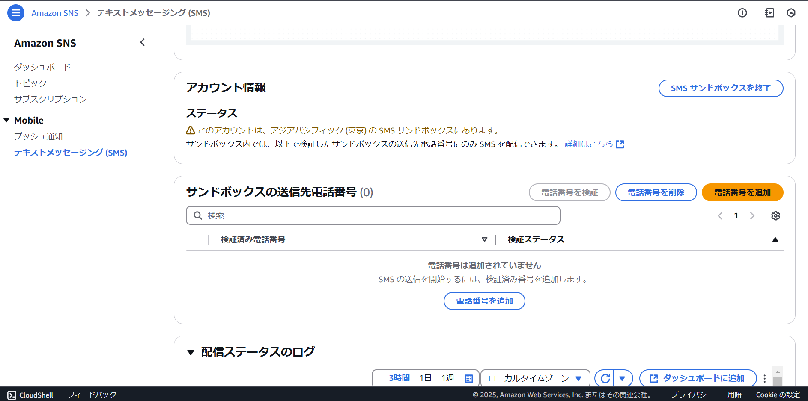

# マネージドログイン
このフォルダは、AWS Cognitoのマネージドログインを使って認証する場合のサンプルコードが含まれています。

PHP/Laravelでコードを記載しております。また、MFAやPasskeyなどをマイページで設定することが可能です。

## 構成 / components

* AWS Cognito
* PHP
* Laravel

## 動かすのに必要な要件 / Environments

* docker
* docker compose

## インストール手順 / Installation

1. 以下などを参考にAWS Cognitoユーザプールを準備します。
    
    [ユーザープールの開始方法](https://docs.aws.amazon.com/ja_jp/cognito/latest/developerguide/getting-started-user-pools.html)

2. ユーザプールの情報を`.env.dev`に記載します。以下を埋めて、貼り付けてください

    ``` bash
    COGNITO_REGION=
    COGNITO_USER_POOL_ID=
    COGNITO_CLIENT_ID=
    COGNITO_CLIENT_SECRET=
    COGNITO_REDIRECT_URI=http://localhost:8080/callback
    COGNITO_LOGOUT_REDIRECT_URI=http://localhost:8080/
    COGNITO_DOMAIN=
    ```

3. コンテナを起動します。

    ``` bash
    docker compose up -d
    ```

    起動後、http://localhost:8080 にアクセスし、`Login`から、サインアップしてください。

## 使用方法 / Usage

### Cognito設定

1. 多要素認証 (MFA)は、`MFAを必須にする` もしくは `オプションのMFA` を選択し、`Authenticator アプリケーション`と`SMS メッセージ`を選択してください

    

1. 認証方法として、`SMS`をONにしていただき、IAMロールを作成してください。検証では、サンドボックスのまま使ってください。送りたい自身の電話番号を、サンドボックス送信先として追加しておきます。

    

    

1. パスキーの動作を検証したい場合は、サインインメニューから選択ベースのサインインのオプションを編集をして、パスキーをONにしてください。ドメインは、Cognito プレフィックスドメインを使ってください。

    
 
## 注意点 / Note

* AWSアクセスキーは不要です
* AWS CognitoやMFA用デバイスは、ご自身で準備してください

## 作成者 / Author

* Kouji Matsuda
* 神戸デジタル・ラボ / 生産技術チーム
