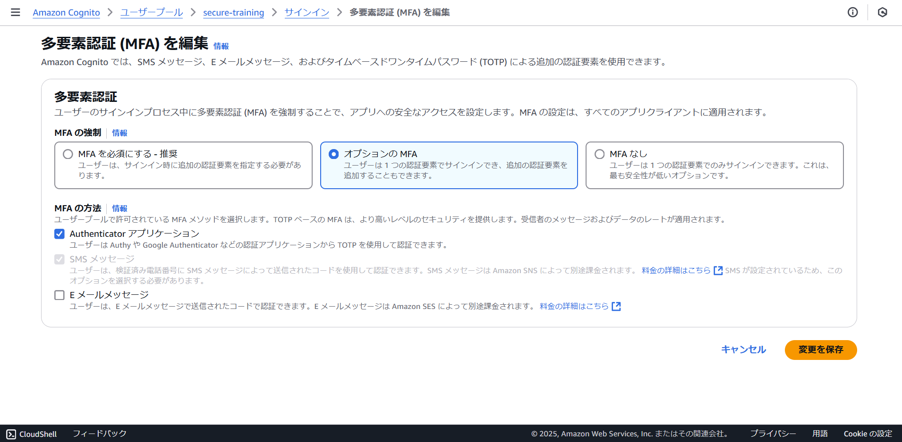
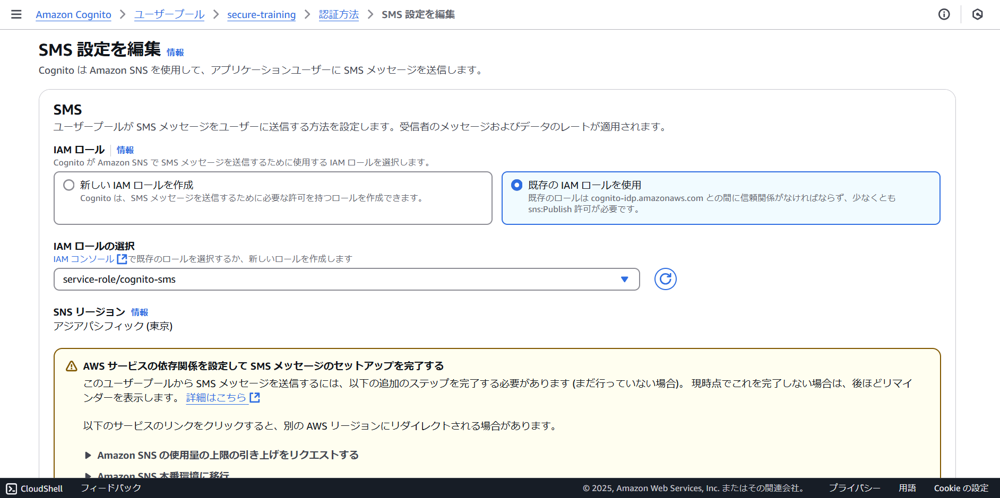
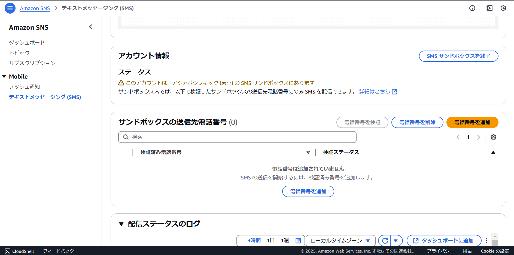

# spa
このフォルダは、AWS Cognitoを使って、SPAで認証を実現するサンプルコードが含まれています。

Reactでコードを記載しております。また、MFAなどをマイページで設定することが可能です。

## 構成 / components

* AWS Cognito
* React
* aws-amplify
* @aws-amplify/ui-react

## 動かすのに必要な要件 / Environments

* nodejs 20 以上

## インストール手順 / Installation

1. 以下などを参考にAWS Cognitoユーザプールを準備します。
    
    [ユーザープールの開始方法](https://docs.aws.amazon.com/ja_jp/cognito/latest/developerguide/getting-started-user-pools.html)

2. ユーザプールの情報を`.env`を作成し記載します。以下を埋めて、貼り付けてください

    ``` bash
    VITE_COGNITO_USER_POOL_ID= // ユーザプールID
    VITE_COGNITO_USER_POOL_CLIENT_ID= // クライアントID
    ```

3. コンテナを起動します。

    ``` bash
    npm install
    npm run dev
    ```

    起動後、http://localhost:5173 にアクセスし、サインアップしてください。

## 使用方法 / Usage

### Cognito設定

1. 多要素認証 (MFA)は、`MFAを必須にする` もしくは `オプションのMFA` を選択し、`Authenticator アプリケーション`と`SMS メッセージ`を選択してください

    

1. 認証方法として、`SMS`をONにしていただき、IAMロールを作成してください。検証では、サンドボックスのまま使ってください。送りたい自身の電話番号を、サンドボックス送信先として追加しておきます。

    

    
 
## 注意点 / Note

* AWSアクセスキーは不要です
* AWS CognitoやMFA用デバイスは、ご自身で準備してください

## 作成者 / Author

* Kouji Matsuda
* 神戸デジタル・ラボ / 生産技術チーム
